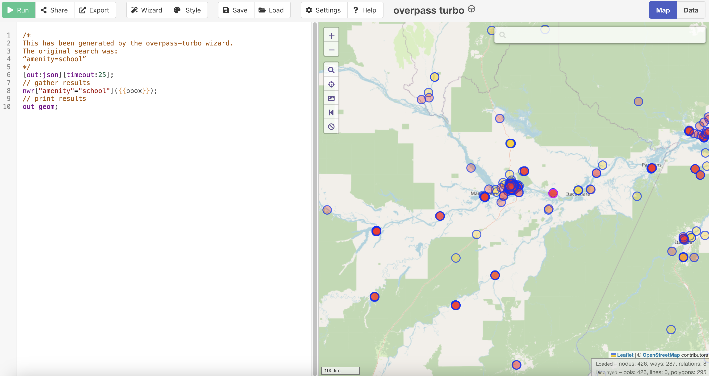

# GIGA-applied-geospatial-tools


 
[](https://www.python.org/)
[](https://qgis.org/)

Training materials for an ITU course provided as part of the following training course:

[Applied geospatial tools for school connectivity](https://academy.itu.int/training-courses/full-catalogue/applied-geospatial-tools-school-connectivity), Geneva – Switzerland, 19-24 May 2025

<a></a>

_Figure: Fiber path analysis in Parintins, Brazil_

## Table of Contents

1. [Overview](#overview)
2. [Data](#data)
  - [Data Repository](#data-repository)
  - [Data Sources](#data-sources)
3. [Training Agenda](#training-agenda)
4. [Prerequisites](#prerequisites)
  - [For Google Colab Users](#for-google-colab-users)
  - [For Local Setup](#for-local-setup)
5. [Setup Instructions](#setup-instructions)
  - [To Run Notebooks Locally](#to-run-notebooks-locally)
  - [To Run Notebooks on Google Colab](#to-run-notebooks-on-google-colab)
6. [Contributing](#contributing)
7. [License](#license)
8. [Contact](#contact)

## Overview

This repository contains links to course slides hosted on a [Google Drive folder](https://drive.google.com/drive/folders/1_8Vhdw0Z_EGt8JfXtLdRLEveEnpTiJ8U?usp=sharing), Jupyter notebooks and supporting materials for a course on infrastructure mapping and analysis.

The course will introduce the methodology used by the International Telecommunication Union (ITU) to measure gaps in ICT infrastructure and for connectivity business planning.  It aims to improve the theoretical and practical skills of participants in collecting ICT infrastructure data, identifying underserved areas, applying GIS tools, and using connectivity models to test and compare selected connectivity scenarios. 

During practical hands-on sessions, participants will learn how to source and prepare their own data using data dictionaries and common standards. The sessions will cover topics such as exploratory data analysis, data validation, visualization, and more advanced topics like visibility analysis for point-to-point connectivity and fiber path analysis. The training will involve practical sessions where participants will gain hands-on experience using QGIS and Jupyter Notebooks, working through real-life case studies related to school connectivity.  

## Data

This course uses a case study of school connectivity in **Amazonas**, the largest state in Brazil containing parts of the Amazon rainforest and cities such as Manaus. While you'll learn to collect and process this data during the training, we provide pre-processed datasets at different stages to help you follow along.

### Data Repository

All training data is available in [this Google Drive folder](https://drive.google.com/drive/folders/17ARjDUsFPtINy63uxhQJfQJ8fU5i8tJx?usp=sharing), organized into the following subfolders:

- **raw/**: Original data as downloaded from various sources, before any processing
- **standardized/**: Cleaned and formatted data following ITU standards and data dictionaries, ready for analysis 
- **raster/**: Geographic raster files for elevation and population density

<a></a>

_Figure: Query OpenStreetMaps using Overpass API_


### Data Sources

| Dataset | Source |
|---------|--------|
| School locations | OpenStreetMap |
| Cell sites | OpenCellID |
| Road network | OpenStreetMap |
| Fiber/transmission nodes | Ookla Speedtest |
| 4G mobile coverage | Operator data |
| Population density | WorldPop |
| Elevation data | SRTM/NASA |

Each source has been chosen to provide reliable, up-to-date information while being representative of data you might use in real-world connectivity planning projects.

## Training agenda

- **Day 1: Fundamentals of Geospatial Analysis, GIGA Connectivity Centre, Geneva**
    - [ICT Infrastructure Business Planning 🔗](https://docs.google.com/presentation/d/1H3zWERvk72W66glb0V19ep3TQGtQM91b/edit?usp=drive_link&ouid=110166480978407115454&rtpof=true&sd=true): Learn about business planning tools to evaluate the commercial viability of an ICT infrastructure project. This module shows how GIS tools are useful to extract the information that allows to compute the revenues and costs associated with a product.
    - [Geospatial Data Types 🔗](https://docs.google.com/presentation/d/1Y_Mnvs8Yyxc755EXSoxab7U_WN2-f5av/edit?usp=drive_link&ouid=110166480978407115454&rtpof=true&sd=true): Master the fundamentals of vector, raster, and tabular data types, and understand when to use each format.
    - [Projections and Coordinate Systems 🔗](https://docs.google.com/presentation/d/1gIbUrVDLulhT8iG8FI-ff8ybL5rBTqxq/edit?usp=drive_link&ouid=110166480978407115454&rtpof=true&sd=true): Learn how to work with different map projections and coordinate systems to ensure accurate spatial analysis.
    - [Telecommunications Open Data 🔗](https://docs.google.com/presentation/d/1DgVWR0CkmU6hrRGHKwL6vr4LkNF7Qk4h/edit?usp=drive_link&ouid=110166480978407115454&rtpof=true&sd=true): Discover various telecommunications data sources, their characteristics, and learn to evaluate their advantages and limitations.
    - [Introduction to QGIS 🔗](https://docs.google.com/presentation/d/1eYJ9CSu2Tv9L7B2EFOE6ak30dY3yoMOW/edit?usp=drive_link&ouid=110166480978407115454&rtpof=true&sd=true): Get started with QGIS, a powerful open-source software for geospatial analysis that will be our main tool throughout the course.
    - [Open Data Collection 🔗](https://docs.google.com/presentation/d/1DJpNSTC24V4i0J_H-CXcFIxHBXQCyhrE/edit?usp=drive_link&ouid=110166480978407115454&rtpof=true&sd=true): Master the tools and techniques for gathering telecommunications data from key sources like OpenStreetMap, GIGA Maps, and OpenCellID using APIs and QGIS plugins.
    - [Data Standardization 🔗](https://docs.google.com/presentation/d/1_eE5mIsL7Sp-lShgZsCJpoWI0ApiVKKT/edit?usp=drive_link&ouid=110166480978407115454&rtpof=true&sd=true): Learn to prepare and clean data according to ITU Data Dictionaries standards using QGIS and SQL, ensuring it's ready for analysis.


- **Day 2: Advanced Models and Python Integration, GIGA Connectivity Centre, Geneva**
    - [Proximity Analysis 🔗](https://docs.google.com/presentation/d/11jxyHK-I2zgjyfretfB9Jv1sJIs0bZp0/edit?usp=drive_link&ouid=110166480978407115454&rtpof=true&sd=true): Calculate distances between Points of Interest and existing infrastructure to help prioritize locations for infrastructure expansion and optimize deployment strategies. Creates graduated symbol maps showing distances to nearest infrastructure.
    - [Coverage Analysis 🔗](https://docs.google.com/presentation/d/16FmvwuCATtca-2qSyeGhmEx6XL4Jfl1B/edit?usp=drive_link&ouid=110166480978407115454&rtpof=true&sd=true): Map and analyze the geographic reach of existing mobile networks to identify areas with limited or no coverage. Generate coverage status maps by technology type (3G/4G/5G).
    - [Demand Analysis 🔗](https://docs.google.com/presentation/d/1qg3T9MEQjEa__P9973otMGvuJ3mYywwQ/edit?usp=drive_link&ouid=110166480978407115454&rtpof=true&sd=true): Calculate potential internet users and required throughput at each PoI using high-resolution population models that combine satellite imagery with census estimates. Includes analysis of population distribution within various buffer zones.
    - [Visibility Analysis 🔗](https://docs.google.com/presentation/d/1C5P7gWGRZZkB7Mu5arM0EOXfzWHQrZbS/edit?usp=drive_link&ouid=110166480978407115454&rtpof=true&sd=true): Evaluate line-of-sight between cell sites and points of interest, considering terrain and physical obstructions. Learn to assess feasibility of radio links and identify optimal locations for infrastructure deployment.
    - [Fiber Path Analysis 🔗](https://docs.google.com/presentation/d/1VPSZQ9zM9g0QlYixRcbot395Wl7zQihj/edit?usp=drive_link&ouid=110166480978407115454&rtpof=true&sd=true): Learn to design efficient fiber networks by leveraging existing infrastructure and optimizing routes for cost-effectiveness.
    - [Python & Google Colab Introduction 🔗](https://docs.google.com/presentation/d/1LuKPKpebqOtkSR5_4qu0Pq0LE3VEH0Lz/edit?usp=drive_link&ouid=110166480978407115454&rtpof=true&sd=true): Learn about the Pros and Cons of using QGIS versus a programmatic approach using Python. Learn about using Google Colab to launch Jupyter notebooks, and discover the main Python libraries for working with geospatial data.
    - [Cost Analysis 🔗](https://docs.google.com/presentation/d/1rcdzljA4PSmP8nWt9wIi5WGbK6oN4HCf/edit?usp=drive_link&ouid=110166480978407115454&rtpof=true&sd=true) using Jupyter notebook `cost_modelling.ipynb` running on Google Colab. Learn to evaluate different technology options (fiber, cellular, point-to-point and satellite) and optimize deployment costs using microeconomic data. Calculate CapEx, OpEx, and potential revenues for different connectivity solutions.

- **Day 3: Site visit to Swiss Federal Technology Institute of Lausanne (EPFL), Lausanne**

- **Day 4: Group work, GIGA Connectivity Centre, Geneva**
    - [Proposal submission 🔗](https://docs.google.com/document/d/1AoPMfhIKJsJqJiiIF0pZB9o8htWWzjXp0L3uAerMi14/edit?usp=drive_link): small groups (3-4 people) to prepare proposals for group work to be carried out over Days 4 and 5.
    - Group work

- **Day 5 (half-day): Group work, GIGA Connectivity Centre, Geneva**
    - Group  work
    - Group presentations: 10 minutes per group
    - End of course evaluation
    - Closing ceremony

## Prerequisites

### For Google Colab Users
- A Google account (e.g., Gmail) to access Google Colab and training data
- No additional software installation required

### For Local Setup
- Python 3.11
- Jupyter Notebook/Lab
- QGIS version 3.34.9 'Prizren LTR' (Long-term release)
 - Available for Windows, Mac, and Linux
 - Required plugins:
   - Open Topography DEM Downloader
   - QNEAT3
   - Visibility Analysis
   - QuickMapServices
   - QuickOSM

## Setup instructions

### To run notebooks locally

1. Clone the repository:

```bash
git clone https://github.com/FNS-Division/GIGA-applied-geospatial-tools
cd GIGA-applied-geospatial-tools
```

2. Create and activate the Conda environment:

```bash
conda env create -f environment.yml
conda activate inframaptraining
```

3. Launch Jupyter:

```bash
jupyter lab
```

### To run notebooks on Google Colab

All notebooks are created using Google Colab for easy accessibility. In order to run them on [Google Colab](https://colab.research.google.com/), you will need to sign in with a Google account. If you are unfamiliar with Google Colab, please watch this [introductory video](https://www.youtube.com/watch?v=inN8seMm7UI).

1. Navigate to each notebook in the repository
2. At the top of each notebook, click on the **Open in Colab** button.

<a href="" target="_parent"></a>

## Contributing

Please submit a pull request to contribute to this repository.

## License

Please refer to our [license](LICENSE).

## Contact

For questions or support, please create an issue in this repository or get in touch at [fns@itu.int](fns@itu.int).
